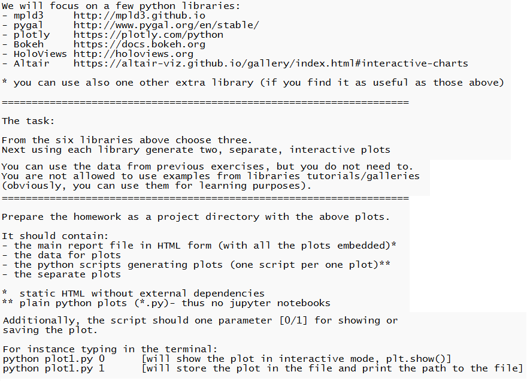

# Overview  
This repository is actually a report made for "Data analysis and visualization" laboratories. It contains various plots and scripts + data to generate them. The goal of this project was to create some interactive plots using different Python libraries. Some scripts may differ by only one line of code, as it was a requirement to have seperate scripts for each plot. The report can be found in the *report.html* file.  
   
Python files must be run with one additional argument, 0 or 1. For example:  
```console
python plotly_1.py 1
```
0 - show plot  
1 - save plot  

## Tasks
  
